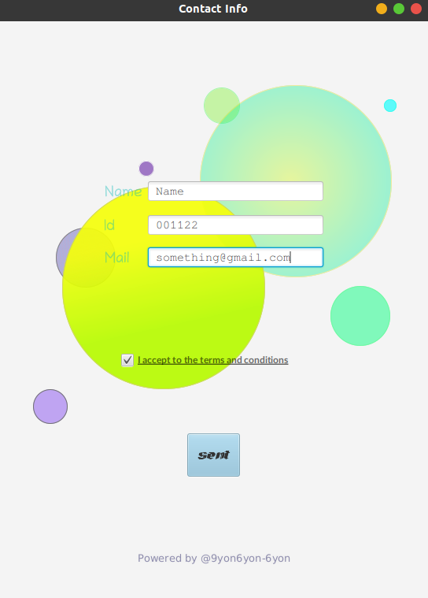

# Info

Information writing in files using a login/create account type form. Used JavaFX for this project and SceneBuilder to implement GUI .

## Usage
 This is a simple input form application that saves the given data to a text file name  `Info.txt`</br>
 Running the application first you will see this GUI form where you have to intput data. [e.g. Next Image](SImpleGUIWithInput.png).


 <p align="center">
  
</p>


Input data can be anything you wanna add. There is no restriction for the input type. It is a `TextField`  so given input will be seen as String as for it is a java programme.
<p align="center">
  
</p>

After the `Send` buton is clicked. A public method called `InfoInFile()` is going to be called and run this program : 

```java
BufferedWriter bufferedWriter = new BufferedWriter(new FileWriter("Informations/info.txt", true));
        PrintWriter printWriter = new PrintWriter(bufferedWriter);
        String name, idNo, mail;
        name = nameField.getText();
        idNo = id.getText();
        mail = mailaddress.getText();
        printWriter.append(name).append("___").append(idNo).append("___").append(mail).append("\n");
        bufferedWriter.close();
        printWriter.close();
        nameField.setText("");
        id.setText("");
        mailaddress.setText("");
```
## Output File
 After the send button operation is done the file called `Info.txt` is going to save the information given in the `textfield` section like this :
  <p align="center"> </p>

  Given data is separated with "`___`" for split operation.